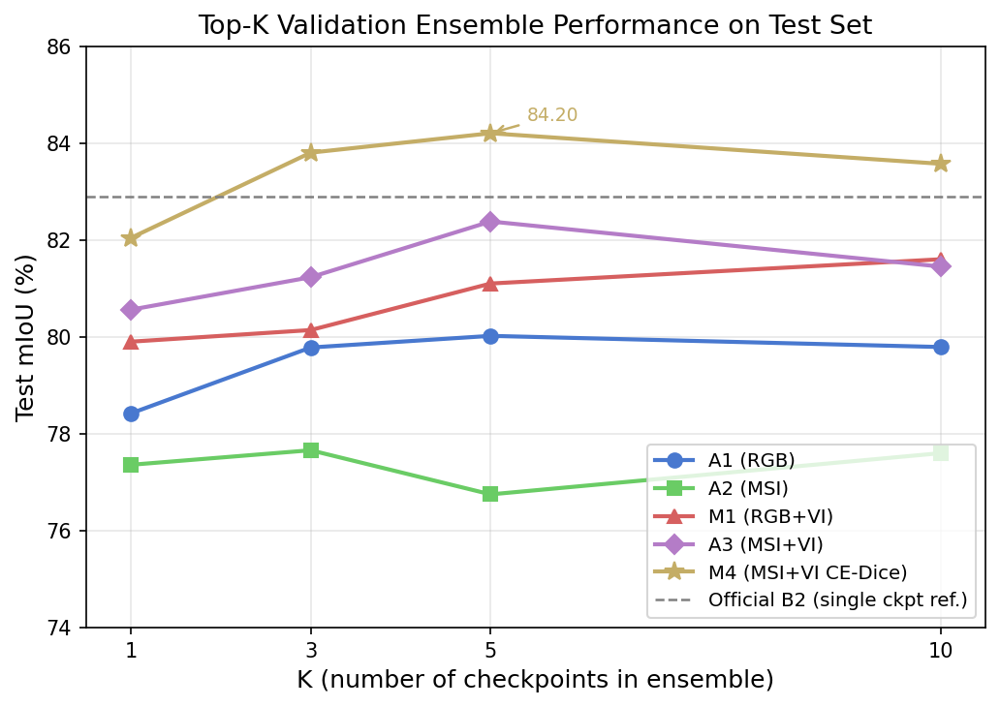
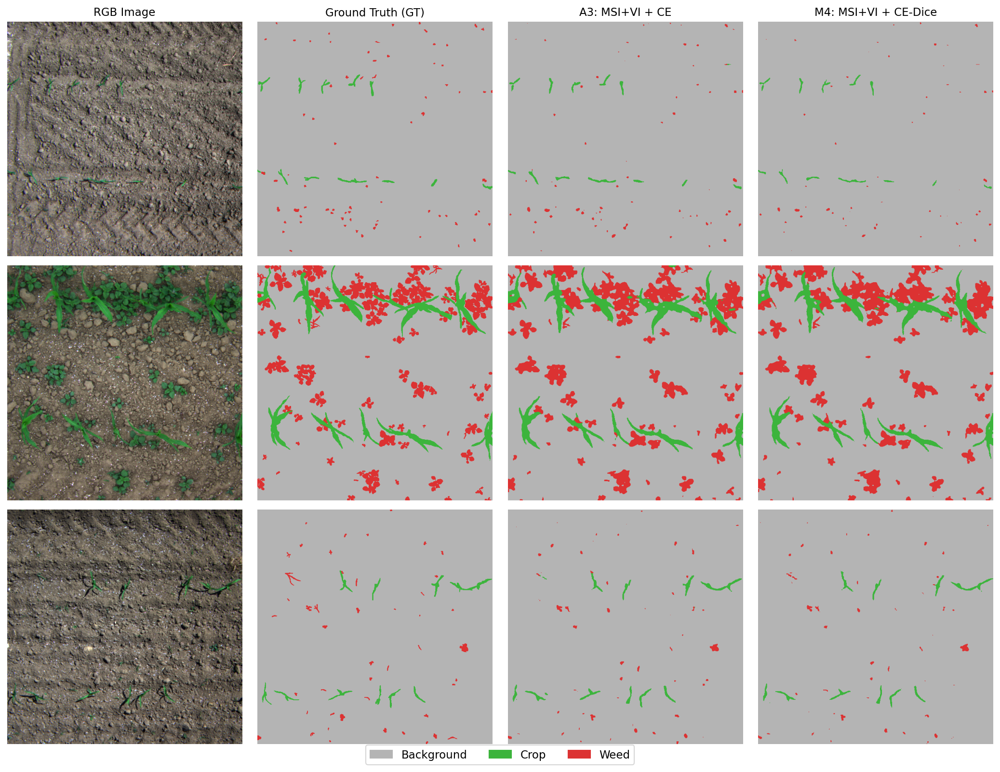
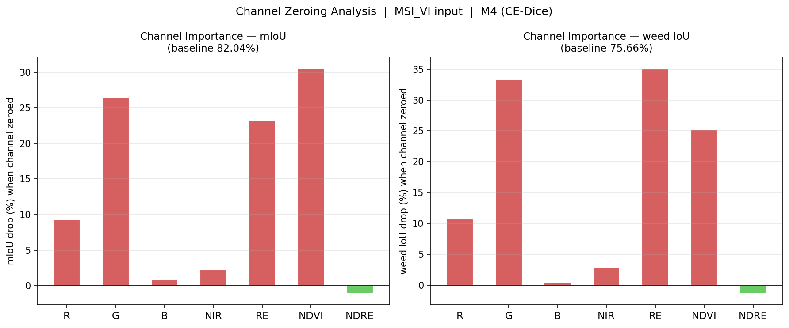

1# WeedsGalore 增强版 — 多光谱作物杂草语义分割

基于 [WeedsGalore](https://github.com/GFZ/weedsgalore) UAV 多光谱数据集（WACV 2025）的系统性消融实验，研究 RGB、原始多光谱波段（MSI）和植被指数（NDVI/NDRE）对作物-杂草分割的贡献。

**最优结果：** MSI+VI 输入 + CE-Dice 损失 + Top-5 验证集 Ensemble → **84.20% test mIoU**、**77.61% weed IoU**。与官方参考结果的协议差异见表3注释。

---

## 核心结论

1. **原始 NIR/RE 波段在固定训练预算下并未带来稳定增益：** 60 epoch 设置下，MSI（76.75%）低于 RGB baseline（80.02%），说明在当前训练设置下，直接堆叠原始多光谱波段并不一定优于 RGB，可能需要更稳定的优化、归一化或融合策略。
2. **NDVI 是最有效的植被信息通道，而 NDRE 贡献边际：** RGB+VI 显著优于 RGB 和 MSI（81.10% vs 80.02% / 76.75%），其中 NDVI 的通道重要性最高；Channel Zeroing 分析进一步表明 NDRE 与 RE/NIR 高度相关，存在冗余，去掉后性能略有提升。
3. **原始光谱波段与植被指数具有互补性：** MSI+VI（82.38%）优于 RGB+VI（81.10%），说明原始光谱波段与植被指数仍有互补性，结合后效果最佳。
4. **CE-Dice 显著提升区域级分割质量：** 在 MSI+VI 输入上，test mIoU 从 82.38% 提升至 84.20%，其他设置不变。
5. **Red Edge（RE）是杂草检测最关键的光谱波段：** 通道逐一清零分析显示，移除 RE 导致 weed IoU 下降 35.16%，是所有通道中影响最大的；这为"原始光谱与植被指数互补"提供了可解释性支撑，并进一步说明为何 MSI+VI 优于 RGB+VI。

---

## 主要结果

### 表1 — 输入模态消融（CE 损失，Top-5 验证集 Ensemble）

| 实验 | 输入 | 通道数 | mIoU | IoU crop | IoU weed |
|---|---|---|---|---|---|
| A1 | RGB | 3 | 80.02% | 70.14% | 71.92% |
| A2 | MSI（RGB+NIR+RE） | 5 | 76.75% | 62.24% | 69.65% |
| M1 | RGB+VI（RGB+NDVI+NDRE） | 5 | 81.10% | 70.47% | 74.52% |
| **A3** | **MSI+VI** | **7** | **82.38%** | **72.82%** | **75.89%** |

> **注：** 所有主表实验采用统一 60 epoch 训练预算。A2 在探索性训练中曾延伸至 80 epoch，80 epoch 下 Top-5 ensemble test mIoU 为 80.37%。这表明原始 MSI 输入可能对训练时长和 checkpoint 选择更敏感。为保证公平对比，主表仅报告 60 epoch 结果。

### 表2 — 方法消融（MSI+VI 输入，Top-5 验证集 Ensemble）

| 实验 | 方法 | K=1 | K=5 | Oracle | Spearman | IoU crop | IoU weed |
|---|---|---|---|---|---|---|---|
| A3 | CE | 80.56% | 82.38% | 83.32% | 0.676 | 72.82% | 75.89% |
| M2 | CE + Attention | 81.65% | 80.13% | 83.59% | 0.672 | 68.82% | 73.19% |
| M3 | CE + partial_mean | 79.28% | 81.64% | 83.85% | 0.722 | 71.25% | 75.24% |
| **M4** | **CE-Dice** | **82.04%** | **84.20%** | **84.58%** | 0.704 | **76.56%** | **77.61%** |

### 表3 — 与官方参考结果对比

| 方法 | 输入 | 损失 | mIoU | IoU crop | IoU weed | 评估协议 |
|---|---|---|---|---|---|---|
| 官方 B1 [1] | RGB | CE | 79.33% | 67.93% | 72.08% | 单 checkpoint（验证集最优） |
| 官方 B2 [1] | MSI | CE | 82.90% | 72.93% | 77.31% | 单 checkpoint（验证集最优） |
| **本文 M4** | **MSI+VI** | **CE-Dice** | **84.20%** | **76.56%** | **77.61%** | Top-5 验证集 Ensemble |

> 注：官方结果作为参考基线列出。本文 M4 与官方 B2 在输入模态（MSI+VI vs MSI）、损失函数（CE-Dice vs CE）、数据增强策略、多通道 conv1 初始化方式（partial_random vs 官方实现设置）和 checkpoint 选择协议（Top-5 验证集 Ensemble vs 单验证集最优 checkpoint）上均不完全相同。因此，该对比不应理解为严格同协议复现比较，而是同一数据集上的参考性结果对比。

### 验证集-测试集排名稳定性（Spearman 相关系数）

| 实验 | Spearman | Pearson | Oracle Gap（Oracle − K=5） |
|---|---|---|---|
| A1（RGB） | 0.854 | 0.907 | 0.34% |
| A2（MSI） | 0.722 | 0.907 | 5.46% |
| M1（RGB+VI） | 0.776 | 0.894 | 1.22% |
| A3（MSI+VI） | 0.676 | 0.902 | 0.94% |
| M4（MSI+VI+CE-Dice） | 0.704 | 0.906 | 0.38% |

基于多光谱输入的模型通常比 RGB 模型具有更低的 Spearman 相关系数，说明验证集 checkpoint 排名可靠性较低。Top-K 验证集 Ensemble 对于训练稳定的配置（如 A3、M4）能有效缩小与 oracle 的差距；但对训练不稳定的变体（如 M2 Attention），更大的 ensemble 未必优于 K=1。

---

## 可视化结果



Top-K 验证集 ensemble 在测试集上的 mIoU 表现。M4 在 K=5 时达到最佳 test mIoU 84.20%；官方 B2 single-checkpoint 结果以虚线作为参考。



RGB 原图、真实标注（GT）、A3（MSI+VI + CE）预测结果和 M4（MSI+VI + CE-Dice）预测结果对比。绿色=作物，红色=杂草，灰色=背景。M4 在 CE-Dice 损失下取得更高的整体 mIoU 和 crop/weed IoU。

---

## 通道重要性分析（Channel Zeroing）

通过逐一将每个输入通道置零，测量对 mIoU 和 weed IoU 的影响，定量评估各通道对 M4 模型预测的贡献：

| 通道 | ΔmIoU（清零后下降） | Δweed IoU | 说明 |
|---|---|---|---|
| **NDVI** | **-30.58%** | -25.21% | mIoU 最关键通道 |
| **G** | -26.49% | -33.31% | 植被绿色反射极重要 |
| **RE** | -23.21% | **-35.16%** | weed 区分最关键通道 |
| R | -9.34% | -10.72% | 中等重要 |
| NIR | -2.22% | -2.93% | 贡献有限 |
| B | -0.86% | -0.51% | 贡献最小 |
| NDRE | +1.11% | +1.38% | 冗余通道，去掉略有提升 |

**分析与解读：**

- **RE（Red Edge）是 weed 区分最关键波段**（清零后 weed IoU 下降 35.16%），远超其他通道。这符合遥感农业常识：红边反射率（约 700-740nm）对植被叶绿素含量和生理状态最敏感，不同作物与杂草在红边的响应差异显著。

- **NDVI 是整体 mIoU 最关键通道**（下降 30.58%），说明归一化植被指数对模型区分植被与背景至关重要，尤其影响 crop 类（下降 65.44%）的检测。

- **G（绿色波段）对 weed 检测贡献仅次于 RE**（weed IoU 下降 33.31%），可能与绿色植被在绿色波段的强反射特性有关。

- **NIR 贡献有限**（mIoU 下降 2.22%），说明 NIR 通道的信息已大部分被 NDVI（由 NIR 计算而来）所涵盖，原始 NIR 的独立贡献较小。

- **NDRE 为冗余通道**（去掉后 mIoU 反而提升 1.11%）。原因在于：`NDRE = (NIR - RE) / (NIR + RE + ε)`，而模型输入中已包含 NIR 和 RE，模型可以隐式学到 NDRE 所携带的信息；额外加入 NDRE 反而引入了轻微冗余干扰。

**核心发现：** Red Edge（RE）是杂草检测最关键的光谱波段，NDVI 对整体分割质量贡献最大；NDRE 与 RE/NIR 高度相关，存在冗余。这一结果支持了主实验的核心结论：植被指数和红边波段是多光谱杂草分割中最有价值的输入通道。



复现命令：

```bash
python channel_zeroing.py \
  --ckpt=outputs/M4-a3_ce_dice/best.pth \
  --input_mode=msi_vi \
  --out_dir=outputs/channel_zeroing
```

---

## 项目结构

```
weedsgalore-enhanced/
├── train.py               # 训练脚本
├── evaluate.py            # 单 checkpoint 评估
├── sweep_checkpoints.py   # 扫描所有 epoch checkpoint（val + test）
├── ensemble_eval.py       # Top-K 验证集 Ensemble 评估
│
├── data/
│   ├── dataset.py         # WeedsGaloreDataset（多通道输入模式）
│   └── __init__.py
│
├── models/
│   ├── attention.py       # InputChannelAttention（SE 风格）
│   ├── deeplabv3plus/     # DeepLabV3+ ResNet50（确定性）
│   └── deeplabv3plus_do/  # DeepLabV3+ ResNet50（含 Dropout）
│
├── losses/
│   └── loss.py            # CE、Focal、Dice、CE-Dice、Focal-Dice
│
├── utils/
│   ├── metrics.py         # 分割指标（mIoU、F1、Recall）
│   └── visualization.py   # 预测结果可视化
│
├── configs/
│   └── experiments.py     # 7 组实验配置（A1-A3、M1-M4）
│
├── experiments/
│   └── run_experiment.py  # 批量实验启动器
│
├── splits/
│   ├── train.txt          # 官方训练集（104 样本）
│   ├── val.txt            # 官方验证集（26 样本）
│   ├── test.txt           # 官方测试集（26 样本）
│   └── cross_date_fold*/  # 留一日期交叉验证划分（3 个 fold）
│
└── outputs/               # 实验 checkpoint 和结果
    ├── A1/                # RGB baseline
    ├── A2/                # MSI
    ├── A3/                # MSI+VI（CE-only 最优）
    ├── M1-rgb_vi/         # RGB+VI
    ├── M2-a3_attention/   # MSI+VI + 通道注意力
    ├── M3-a3_partial_mean/# MSI+VI + partial_mean 初始化
    └── M4-a3_ce_dice/     # MSI+VI + CE-Dice（总体最优）
```

---

## 环境配置

```bash
# 虚拟环境（Python 3.9+，CUDA 11.8）
cd weedsgalore-enhanced
.venv\Scripts\activate      # Windows
source .venv/bin/activate   # Linux/macOS

python -c "import torch; print(torch.__version__)"  # 2.0.1+cu118
```

**核心依赖：** PyTorch 2.0.1+cu118、TorchVision 0.15.2、NumPy 1.26.4、Pillow、absl-py、torchmetrics 1.9.0、TensorBoard、scipy

---

## 数据集

下载地址：https://doidata.gfz.de/weedsgalore_e_celikkan_2024/

目录结构：
```
weedsgalore-dataset/
├── 2023-05-25/
│   ├── images/      # {名称}_R/G/B/NIR/RE.png（16-bit PNG）
│   └── semantics/   # {名称}.png（类别索引 PNG）
├── 2023-05-30/
├── 2023-06-06/
└── 2023-06-15/
```

标签映射：0=背景，1=作物，2-5=杂草种类（3 类任务将 2-5 合并为 2）

---

## 输入模式

| 模式 | 通道数 | 组成 |
|---|---|---|
| `rgb` | 3 | R、G、B |
| `msi` | 5 | R、G、B、NIR、RE |
| `vi` | 5 | R、G、B、NDVI、NDRE |
| `msi_vi` | 7 | R、G、B、NIR、RE、NDVI、NDRE |

植被指数公式：`NDVI = (NIR-R)/(NIR+R+ε)`，`NDRE = (NIR-RE)/(NIR+RE+ε)` [Rouse et al. 1974；Gitelson & Merzlyak 1994]

---

## 训练

```bash
# M4 — 最优配置
python train.py \
  --dataset_path=../weedsgalore-dataset \
  --input_mode=msi_vi \
  --num_classes=3 \
  --conv1_init=partial_random \
  --loss_type=ce_dice \
  --epochs=60 \
  --batch_size=8 \
  --seed=42 \
  --out_dir=outputs/M4-a3_ce_dice

# A3 — MSI+VI + CE（输入消融基准）
python train.py \
  --dataset_path=../weedsgalore-dataset \
  --input_mode=msi_vi \
  --num_classes=3 \
  --conv1_init=partial_random \
  --loss_type=ce \
  --epochs=60 \
  --batch_size=8 \
  --seed=42 \
  --out_dir=outputs/A3
```

**主要训练参数：**

| 参数 | 默认值 | 可选值 |
|---|---|---|
| `--input_mode` | `msi` | `rgb`、`msi`、`vi`、`msi_vi` |
| `--conv1_init` | `partial_random` | `random`、`partial_random`、`partial_mean` |
| `--loss_type` | `ce` | `ce`、`focal`、`dice`、`ce_dice`、`focal_dice` |
| `--use_attention` | `False` | SE 输入通道注意力 |
| `--seed` | `42` | 随机种子 |
| `--splits_dir` | `None` | 默认使用项目 `splits/`；可指定自定义划分目录（用于跨日期实验） |

---

## 评估流程

### 第一步：扫描所有 epoch checkpoint

```bash
python sweep_checkpoints.py \
  --ckpt_dir=outputs/M4-a3_ce_dice \
  --dataset_path=../weedsgalore-dataset \
  --input_mode=msi_vi \
  --conv1_init=partial_random \
  --out_csv=outputs/M4-a3_ce_dice/sweep.csv
```

### 第二步：Top-K 验证集 Ensemble

```bash
# K=5（推荐）
python ensemble_eval.py \
  --sweep_csv=outputs/M4-a3_ce_dice/sweep.csv \
  --ckpt_dir=outputs/M4-a3_ce_dice \
  --dataset_path=../weedsgalore-dataset \
  --input_mode=msi_vi \
  --conv1_init=partial_random \
  --topk=5
```

### 第三步：单 checkpoint 评估

```bash
python evaluate.py \
  --dataset_path=../weedsgalore-dataset \
  --input_mode=msi_vi \
  --num_classes=3 \
  --conv1_init=partial_random \
  --split=test \
  --ckpt=outputs/M4-a3_ce_dice/best.pth \
  --out_dir=outputs/M4-a3_ce_dice/eval_test \
  --save_visualizations=true
```

---

## 批量实验

```bash
# 运行全部 7 个实验
python experiments/run_experiment.py \
  --exp=ALL \
  --dataset_path=../weedsgalore-dataset \
  --epochs=60

# 运行指定实验
python experiments/run_experiment.py \
  --exp=A1,A3,M4 \
  --dataset_path=../weedsgalore-dataset \
  --epochs=60
```

---

## 训练协议说明

所有主实验采用统一的训练协议：60 epoch、batch size 8、Adam 优化器（lr=0.001）、相同随机种子（seed=42）、官方 train/val/test 划分。

**数据增强**（仅训练集）：随机 0/90/180/270 度旋转、随机水平或垂直翻转（互斥）、高斯噪声（σ=1/25）。验证集和测试集不使用增强。

**多通道 conv1 初始化**：输入通道不等于 3 时，第一层卷积替换为与输入维度匹配的新层。本文默认采用 `partial_random`：RGB 三通道继承 ImageNet 预训练 ResNet50 的 conv1 权重，额外通道（NIR、RE、NDVI、NDRE）采用 Kaiming 随机初始化。M3 单独测试了 `partial_mean` 初始化，其余多通道实验（A2、A3、M1、M2、M4）均采用 `partial_random`。

**Checkpoint 选择**：每轮在验证集上计算 mIoU，保存所有 epoch 权重；正式评估采用 Top-5 验证集 Ensemble（从 60 epoch 内按验证集 mIoU 选取前5个 checkpoint 进行预测平均）。

---

## 多通道 conv1 初始化策略

当 `in_channels != 3` 时，第一层卷积需要替换。三种策略：

| 策略 | RGB 通道 | 额外通道 | 说明 |
|---|---|---|---|
| `random` | 随机初始化 | 随机初始化 | 所有输入通道从头学习 |
| `partial_random` | ImageNet 预训练 | Kaiming 随机初始化 | **本文主实验默认设置** |
| `partial_mean` | ImageNet 预训练 | RGB 滤波器均值填充 | M3 中测试；Spearman 略高（0.722），但 Top-5 test 低于 A3 |

`partial_random` 作为默认设置，原因是保留了 ImageNet 预训练的 RGB 滤波器，同时允许额外光谱通道（NIR、RE、NDVI、NDRE）通过 Kaiming 初始化从头学习。

---

## 模型架构

DeepLabV3+（ResNet50 backbone）[Chen et al., 2018；He et al., 2016]：
- ASPP（空洞空间金字塔池化）实现多尺度上下文建模
- 解码器融合低层与高层特征
- conv1 适配多通道输入（见上方初始化说明）

可选：`--use_attention=True` 在 backbone 前加入轻量 SE 风格输入通道注意力 [Hu et al., 2018]。

---

## 参考文献

[1] Celikkan et al., *WeedsGalore: A Multispectral and Multitemporal UAV-Based Dataset for Crop and Weed Segmentation in Agricultural Maize Fields*, WACV 2025. https://arxiv.org/abs/2502.13103

[2] Chen et al., *Encoder-Decoder with Atrous Separable Convolution for Semantic Image Segmentation*（DeepLabV3+），ECCV 2018.

[3] He et al., *Deep Residual Learning for Image Recognition*（ResNet），CVPR 2016.

[4] Hu et al., *Squeeze-and-Excitation Networks*（SE 注意力），CVPR 2018.

[5] Milletari et al., *V-Net: Fully Convolutional Neural Networks for Volumetric Medical Image Segmentation*（Dice 损失），3DV 2016.

[6] Rouse et al., *Monitoring vegetation systems in the Great Plains with ERTS*, 1974.（NDVI）

[7] Gitelson & Merzlyak, *Spectral reflectance changes associated with autumn senescence*, 1994.（NDRE）

---

## 后续工作

当前实验基于官方 train/val/test 划分，三个子集在各采集日期上均有样本。后续可进一步采用日期隔离的留一日期交叉验证（Leave-One-Date-Out）或前向时序划分，评估模型在不同采集日期、作物生长阶段和光照条件下的跨日期泛化能力。相关划分文件已生成于 `splits/cross_date_fold*/`。

---

## 引用

```bibtex
@InProceedings{Celikkan_2025_WACV,
    author    = {Celikkan, Ekin and Kunzmann, Timo and Yeskaliyev, Yertay
                 and Itzerott, Sibylle and Klein, Nadja and Herold, Martin},
    title     = {WeedsGalore: A Multispectral and Multitemporal UAV-Based
                 Dataset for Crop and Weed Segmentation in Agricultural Maize Fields},
    booktitle = {Proceedings of WACV},
    year      = {2025},
    pages     = {4767--4777}
}
```
